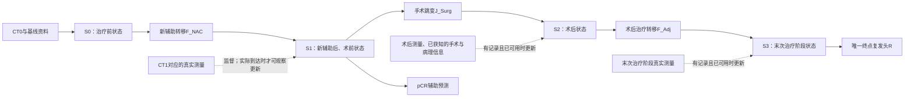

日期：2026-10-01。针对用户“为什么C1之后没有后续状态，这还是多阶段吗”的设计修正。

上一版C0→C1→R只有两个测量时点、一次显式转移，不能代表完整四阶段世界模型。它应作为双CT可监督的子实验。主模型必须保留S0→S1→S2→S3，并将手术和术后治疗的实际状态变化写进结构。本文仅修订设计，尚未实现新的概念网络或启动训练；已训练动态代码仍保留原有阶段。

完整目标结构：

S3沿用当前回顾性末次治疗阶段定义，不是统一随访年份；未来补齐真实时间后再锁定共同评价终点。图中的观测更新不是从S0推演时可读取的未来真值。从S0预测须走prior；已经到达后续时点且观测确实可用时才走posterior，两种任务分别评价。不能把CT或病理的既有记录索引自动当成真实临床可用时间。

直接手术路径的结构应允许S0经手术转移直接到S2，不伪造经历新辅助的S1。当前缓存缺乏经核实且足量的直接手术对照，此分支的架构定义不等于已能可靠估计治疗效应。

**C是概念，S是完整状态。**统一接口可写为：

`S_t = (B, C_t, A_t, H_t; validity_t, source_t, uncertainty_t)`。

B是明确的固定基线变量，C_t是当前命名测量，A_t是器官/治疗完成等已知事实，H_t是来源和时间明确的历史概念记录。后半部分记录适用性、观测/预测/缺失来源以及不确定性，用于监督掩码、展示和支持检查，不默认成为自由的复发特征。所有阶段使用同一份概念字典；同一字段含义、单位和观测规则不变，但不要求每个字段在每个阶段都适用或已被观察。

| 状态 | 应表达什么 | 可用监督与需补充内容 |
| --- | --- | --- |
| S0 | 治疗前病灶测量与基线背景 | CT0医生测量；原有六项临床变量 |
| S1 | 新辅助后、术前的同定义病灶测量 | CT1医生测量；适用的pCR/切除病理可作为未来取得的响应监督 |
| S2 | 已实施手术造成的解剖改变、当前可测状态、截至此时已取得的信息 | 需核实切除范围、切缘记录、术后当前测量和可用时间；切除标本病理只保留为标本/历史证据 |
| S3 | 末次治疗阶段的当前可测状态及保留的已验证历史 | 需收集与该阶段匹配且在预测截止前可用的检查/功能/影像测量，不把已发生复发或未来诊断当输入 |

例：原胃目标病灶直径在相应组织切除后变为“不适用”，不是把全身病灶负荷或复发风险置0。对应术前测量仍可留在H_t。切缘、ypT/ypN、切除阳性结节数均有各自定义；ypN不能改名为术后体内阳性结节数。未测量的微转移负荷不能命名为已验证概念。

**手术与药物治疗都保留转移，但不强制具有相同机制。**F_NAC与F_Adj可共享小型核心和少量手段/阶段条件参数；手术使用独立的类型约束跳变J_Surg。被实际记录支持的解剖/适用性变化可以确定性更新；其余生物变化由相应阶段测量学习。H_t的更新是明确的字段保留和可用信息追加，不引入任意高维memory。共享不是已经成立的医学假设，仍需与不共享的小型模型比较。

**唯一复发头作用于S3。**完整模型的R读取S3中的验证概念、必要的具名历史和披露的基线字段；不读取原始影像token或自由隐状态。S3保留术前病情并不违反终点监督。可用低自由度加法形式：

`logit p = beta0 + b(B) + sum_j f_j(approved_named_fields(S3))`。

历史变量和当前变量可能相关；只保留少量预先声明字段并正则化。缺失填补方案必须训练内拟合且明确披露，缺失和结构性不适用不混作0。不能把掩码本身或不确定性输出未经审计地当作额外风险旁路。

**完整监督结构与当前缺口。**设计上的损失包含各阶段实际可用观测误差、适用S1的pCR辅助损失、事实S3的复发损失与小型转移的正则项：

`L = sum_{t=0}^3 lambda_t L_observed,t + lambda_p L_pCR,S1 + lambda_y BCE(R(S3),Y) + lambda_reg Omega`。

每一阶段观测损失只在真正取得、定义匹配的标签上计算。pCR在S1输出预测，真值通常来自后续切除病理；作为未来监督目标不等于可以作为S1输入。C0/C1的新医生测量尚需实际采集；目前缓存也没有真实S2/S3状态测量，故不能把上述各项描述成已可计算。

严格可解释主模型的训练顺序为：按真实观测训练测量与相应转移模块，再冻结已验证的概念接口训练R。模块无相应观测时，其语义验证不能通过。若临时保留终点反向监督F_Surg/F_Adj或加入极小潜变量作为现有数据对照，必须单列为弱监督/部分可解释模型，不能继承主模型的“风险只经过已验证概念”声明。

终点损失可使缺少中间标签的多阶段网络拟合结局，但只有末端输出无法唯一确定中间的生物含义和各段治疗贡献。把同样的向量维度连起来、共享读出或加平滑正则，都不能补出这些观测。对固定事件标志的更新只能证明病程记录被保留，不能证明已学会治疗后疾病变化。

**各阶段风险通过继续推演获得。**例如在S1：

`r_1(pi) = R(F_Adj(J_Surg(S1, a_surg), a_adj))`。

S2同样通过F_Adj到S3后读出；S0需先经过所指定的新辅助或直接手术路径。若预测为概率状态，应对可能轨迹的终点概率求平均，不能默认对平均状态一次读出等价。以上是给定后续策略的模型预测；在当前时序、观测和治疗支持不充分的资料上，不称为已识别的反事实治疗效应。

**执行范围与防过拟合。**四阶段不会被删减来换取更少参数；削减的是各阶段的自由度和未解释的终点旁路。采用低维命名状态、小型共享药物转移、独立手术规则及简单终点头。先将S0→S1作为有测量支持的机制验证，再补齐S2/S3观测并验证全链；必须分别报告结构实现、阶段预测误差与临床解释性证据。患者外层划分仍为456/65/130。

与现有代码的关系：N03/N04旧动态模型及N13小型GRU仍有三次事件更新；本次没有删改它们。新概念四阶段网络尚未实现，当前文档纠正的是上次建议把局部子实验画成主模型的问题。
