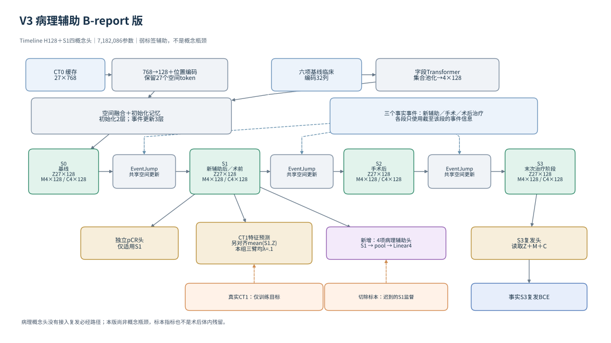
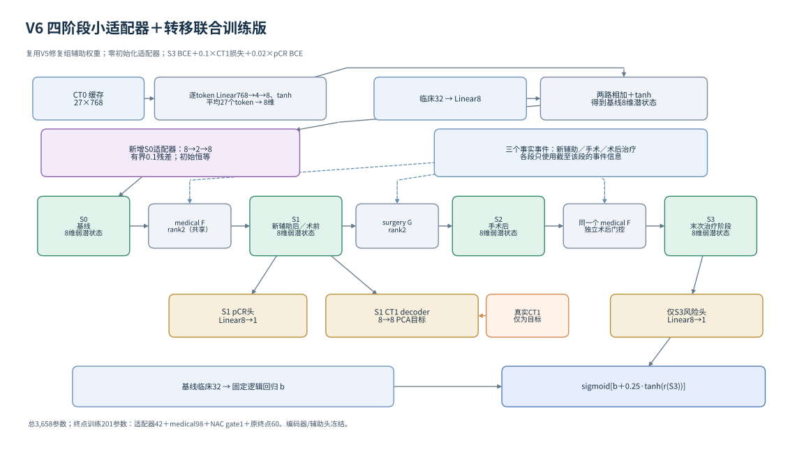

# V3 / V6 代码导航与复现说明

整理日期：2026-10-02。V3、V6 是网络盘点中的版本名称，不是历史 Git tag。
本目录对应原训练库的实现及固定实验配方；源文件对照见
[发布清单](source_manifest.json)，不是重新设计网络或重新训练的结果。

| | V3：病理报告辅助监督 | V6：四阶段适配器联合训练 |
| --- | --- | --- |
| 核心类 | `TimelineModel` | `FourStageModel(state_adapter_rank=2)` |
| 完整路径 | S0 → 新辅助 → S1 → 手术 → S2 → 术后治疗 → S3 | 同样保留完整四阶段 |
| 状态 | 空间 Z：27×128；记忆 M：4×128；临床 C：4×128 | 每阶段 8 维潜状态 |
| 模型参数 | 7,182,086（包括本配方不启用的日历漂移和观察更新模块） | 总计 3,658；终点训练 201 |
| S1 输出 | pCR、CT1 特征、四项报告概念 | pCR、CT1 的 8 维 PCA 目标 |
| 复发输出 | 事实 S3；读取潜状态 Z/M/C | 事实 S3；固定临床 logit + 有界状态修正 |
| 概念解释性 | 报告字段为弱标签；复发头可以绕过概念头 | 弱潜状态，没有经过真实测量验证的概念坐标 |
| 公开训练入口 | `scripts/run_terminal.py --suite B-report-pilot` | `scripts/run_four_stage_ablation.py` 的 `ct_pcr_adapter` 臂 |

当前协议是 **651 人，固定 456 / 65 / 130，7:1:2，划分 seed17**。
模型训练种子与划分种子不同。下文 V6 使用十个训练种子，但患者划分保持不变。
仓库其他历史文档中的 521 人交叉验证属于旧协议。

## V3：状态、事件、输出与损失



CT0 是冻结上游编码器生成的 27×768 特征缓存。训练中的 Linear 投影和位置编码
将其变为 27×128；六项基线临床变量的 32 列编码经过字段 Transformer 和集合读出，
得到 4×128 临床 token。空间融合初始化 S0 的 Z/M/C。

三段事件由七种治疗手段及阶段等元信息编码，经因果历史编码后驱动共享
`EventJump`。事件更新包含空间自注意力、交叉注意力、3D 深度卷积、前馈层和
门控残差；记忆也随阶段更新。这里使用阶段顺序，没有可靠治疗日期驱动的连续时间演化。

S1 分别接 pCR、CT1 和报告概念头；S3 单独接复发头。报告概念头不构成复发预测的
必经瓶颈。CT1、病理字段、pCR 和复发标签只作训练目标，不作为本配方的前向输入。

四个报告目标为：活原发肿瘤存在、残余活肿瘤比例、切除标本阳性淋巴结数、原发灶最大直径。
第一项是二元标签；后三项先分别做比例 / log1p / log1p 变换，再在训练集内标准化。
缺失、冲突和不适用字段被屏蔽。标签对应切除前 S1 的疾病，由 S2 或以后取得的
切除病理提供迟到监督，不能当作术后体内残余肿瘤的测量。

```text
L = BCE(recurrence at factual S3)
  + 0.1 × (CT set loss + CT moment loss)
  + 0.1 × BCE(pCR at applicable factual S1)
  + 0.1 × S1-to-CT1 alignment
  + λ_report × masked report-concept loss
λ_report ∈ {0, 0.01, 0.1}
```

| 源文件 | 阅读重点 |
| --- | --- |
| [timeline_model.py](../../src/stageworld_tcwm/timeline_model.py) | 初始化、状态推进、S1 辅助读出、事实 S3 复发边界 |
| [timeline_config.py](../../src/stageworld_tcwm/timeline_config.py) | `terminal_state_v1`、H128、关闭 CT1 同化 |
| [event_encoder.py](../../src/stageworld_tcwm/event_encoder.py) | 治疗字段、事件 token、因果事件历史 |
| [event_jump.py](../../src/stageworld_tcwm/event_jump.py) / [spatial_dynamics.py](../../src/stageworld_tcwm/spatial_dynamics.py) | 共享空间状态及记忆更新 |
| [timeline_losses.py](../../src/stageworld_tcwm/timeline_losses.py) | 终点掩码、pCR 适用性、CT 和报告损失 |
| [timeline_training.py](../../src/stageworld_tcwm/timeline_training.py) | 训练内统计、选模、状态保存和导出 |
| [report_concept_data.py](../../src/stageworld_tcwm/report_concept_data.py) / [report_schema.py](../../src/stageworld_tcwm/report_schema.py) | 报告证据校验、标签变换、来源及可用阶段合同 |
| [modality_inference.py](../../src/stageworld_tcwm/modality_inference.py) | 推理、支持掩码和显式后续策略续推 |
| [report_concepts_v1.json](../../configs/terminal/report_concepts_v1.json) | V3 固定基础配置；运行器覆盖每臂 λ_report |

## V6：小状态与受限微调



每个 CT0 token 经过 `768 → 4 → 8 → tanh`，再对 27 个 token 平均。
临床 `32 → 8` 与影像相加、经过 tanh，形成基线状态。新增 `8 → 2 → 8` 的
适配器输出 `0.1×tanh(...)` 残差；上投影初始化为零，初始保持原状态。

新辅助和术后治疗共用 rank2 的 medical 转移，各自有一个标量门控；手术使用独立
rank2 转移，并且只在手术已知且存在时作用。不适用治疗槽的条件编码全部置零，
避免冻结后使用未受辅助训练约束的条件列；未知、已知无、已知有仍被区分。

```text
S1 = S0 + F_medical(S0, a_NAC) × (1 + 0.1×tanh(g_NAC))
S2 = S1 + G_surgery(S1, a_surgery) × surgery_present
S3 = S2 + F_medical(S2, a_post) × (1 + 0.1×tanh(g_post))
logit(recurrence) = clinical_logit + 0.25×tanh(Linear(S3))
```

0.25 限制的是 logit 修正，不是直接限制概率变化。pCR 和 CT1 头仍位于 S1。
CT1 的目标空间用训练集 CT0 拟合的 PCA 和统计量定义。

V6 先载入同种子、修复条件编码后的父实验 `aux_best.pt`，再微调 201 个参数：
适配器 42 + medical 98 + NAC 门控 1，共 141 个使用学习率 1e-4；
手术 50 + 术后门控 1 + 复发头 9，共 60 个使用 5e-4。
原影像/临床编码器、临床参考和 S1 辅助头冻结，但辅助头仍向 S1 传递梯度。

```text
L_terminal = BCE(recurrence at factual S3)
           + 0.1 × SmoothL1(CT1)
           + 0.02 × BCE(pCR at applicable factual S1)
```

| 源文件 | 阅读重点 |
| --- | --- |
| [four_stage_model.py](../../src/stageworld_tcwm/four_stage_model.py) | 8 维状态、适配器、共享 medical、独立手术、输出与冻结 |
| [four_stage_training.py](../../src/stageworld_tcwm/four_stage_training.py) | 三个实验配方、两阶段训练、父权重复用、201 参数分组、选模 |
| [run_four_stage.py](../../scripts/run_four_stage.py) | 十种子父实验、固定划分、训练／验证模式 |
| [run_four_stage_ablation.py](../../scripts/run_four_stage_ablation.py) | 配对父模型审计、两臂并行、禁止测试访问、验证重载复现 |
| [research_neural.py](../../src/stageworld_tcwm/research_neural.py) / [research_baselines.py](../../src/stageworld_tcwm/research_baselines.py) | 共享输入边界、指标、训练内临床对照 |
| [实验协议](../FOUR_STAGE_AUXILIARY_ADAPTER_EXPERIMENTS_20261001.md) | 固定配方与比较范围 |

V6 运行器同时包含 `pcr_only_frozen` 对照，每臂十个种子。对照从头训练，终点仅训练
60 个参数；适配器臂复用父辅助权重，本轮不重复辅助阶段。

## 安装与无数据检查

以下命令在仓库根目录开始。推荐 Python 3.12；CPU 工程检查不需要患者数据或 GPU。

```bash
python -m pip install -e './gastric_tcwm_upgrade[dev,timeline]'
cd gastric_tcwm_upgrade
OMP_NUM_THREADS=1 MKL_NUM_THREADS=1 python -m pytest -q
python scripts/demo_v3_v6.py
```

演示只创建合成张量、前向计算四个状态并打印维度与参数数量，不是临床性能测试。
直接读取已有标准缓存不需要旧项目；从旧原始 pool 重建临床编码时，还需要原项目的
`stageworld.data.baseline_clinical` 等编码依赖。公开测试中这部分可选集成测试默认跳过，
提供 `GASTRIC_CLINICAL_SOURCE_ROOT` 后运行。其余网络及训练测试独立于旧项目。

## 在有数据权限的环境复现

数据结构与所需文件见 [数据合同](DATA_CONTRACT.md)。下面环境变量由使用者配置为
自己的数据和新输出目录；权重及患者级产物应保存在公开仓库外。

V3 的准备和训练命令：

```bash
# 仅在尚无报告增强缓存时执行；输出目录必须不存在。
python scripts/prepare_report_concepts.py \
  --data-root "$GASTRIC_DATA_ROOT" --reports "$GASTRIC_REPORTS" \
  --original-pool "$GASTRIC_ORIGINAL_POOL" --out "$GASTRIC_REPORT_DATA_ROOT"

# 工程短程运行不评分测试集，和正式运行使用不同输出目录。
python scripts/run_terminal.py --suite B-report-pilot \
  --data-root "$GASTRIC_REPORT_DATA_ROOT" --out "$V3_DIAGNOSTIC_OUT" \
  --device cpu --parallel-jobs 1 --diagnostic

# 重放正式三臂实验：会对验证选中的各臂检查点评分测试集。
python scripts/run_terminal.py --suite B-report-pilot \
  --data-root "$GASTRIC_REPORT_DATA_ROOT" --out "$V3_REPLAY_OUT" \
  --device cuda --parallel-jobs 3 --threads 2
```

V3 正式配方为 batch8、梯度累积2、最多500次优化更新，每50次验证，最少100次更新，
耐心5次验证。它保留当时的实验日程，不套用后续 V6 的100 epoch日程。

V6 需要完整的、固定十种子父实验，包括 `aux_best.pt`、`aux_last.pt`、指标及完成凭证。
已有完整父实验时直接设置 `GASTRIC_V6_PARENT`；否则在独立新目录先运行父实验：

```bash
python scripts/run_four_stage.py --mode weak_four_stage \
  --data-root "$GASTRIC_DATA_ROOT" --out "$GASTRIC_V6_PARENT" \
  --train-validation-only --device cpu --threads 2

python scripts/run_four_stage_ablation.py \
  --data-root "$GASTRIC_DATA_ROOT" --parent "$GASTRIC_V6_PARENT" \
  --out "$V6_COMPARISON_OUT"
```

第二条命令启动两臂各十种子、两名独立 CPU 工作进程，每进程2线程；没有只选适配器臂的
CLI 选项，也没有测试评分入口。十种子为 17、29、43、71、101、137、173、211、257、307。
实际执行的每个训练阶段最多100 epoch、batch8、每 epoch 验证，前30 epoch不累计早停耐心，
此后连续20轮无改善停止，最早第50轮。恢复父 `aux_last` 的随机状态用于配对终点批次。

所有正式运行器检查原划分 SHA256 和 456/65/130 人数；更换为新的合成 ID 文件会被拒绝。
合成演示使用底层模型接口，不绕过正式研究合同。新发布副本因路径、依赖打包和源文件集合
变化，源码哈希不同于历史运行，不能用于原地续训历史锁定目录；新复现必须用新目录。

## 已有结果及解释范围

下面是已完成研究的汇总，发布整理没有追加训练或重评分测试集。

| V3 实验臂 | 验证 AUC | 验证 NLL | 测试 AUC |
| --- | ---: | ---: | ---: |
| report_control | 0.410667 | 0.553027 | 0.537385 |
| report_weight001 | 0.409333 | 0.552989 | 0.538409 |
| report_weight01 | 0.414667 | 0.552554 | 0.540799 |

三臂都实际训练300次更新、选中第50次更新；验证NLL选中 `report_weight01`。
四个概念的二元BCE或连续MSE均未超过训练集常数基线，不能宣称概念已得到验证。

V6 `ct_pcr_adapter` 十种子均实际终点训练50 epoch、选中终点 epoch0 的临床参考，
最终验证 AUC **0.724000**、NLL **0.477727**；**尚未评分测试集**。
相同最终分数来自退回同一临床参考，不表示十条训练轨迹相同，也不证明动态模块有效。
配套 `pcr_only_frozen` 对照十种子均选中训练后的检查点，平均验证 AUC 0.727067、
NLL 0.475375，也没有测试结果；这只是小幅验证改善。

上述终点是记录性复发标签，尚不是统一时间窗的生存风险。两版都没有验证全部阶段的
医学概念，也没有可靠的治疗因果识别条件。V3 的显式续推是给定后续路径的情景预测；
V6 公开复发接口要求完整事实 S3，不能将 S1 直接塞入终点头当作已校准中间风险。

## 发布改动与溯源

网络、损失和训练计算代码直接来自原训练库。发布适配限于服务器路径参数化、
打包同一病理证据校验器及其依赖、可选旧编码器测试路径、文档/结构图/合成演示。
原始训练文件未在这次发布中改写。

[源文件清单](source_manifest.json)逐文件列出原代码与发布代码 SHA256，
`unchanged` 表示字节一致。两个历史设计文件保留原意并移除了部署路径；
其中严格概念模型是设计目标，不代表 V6 已实现。许可和来源延续 [NOTICE](../../NOTICE.md)。
