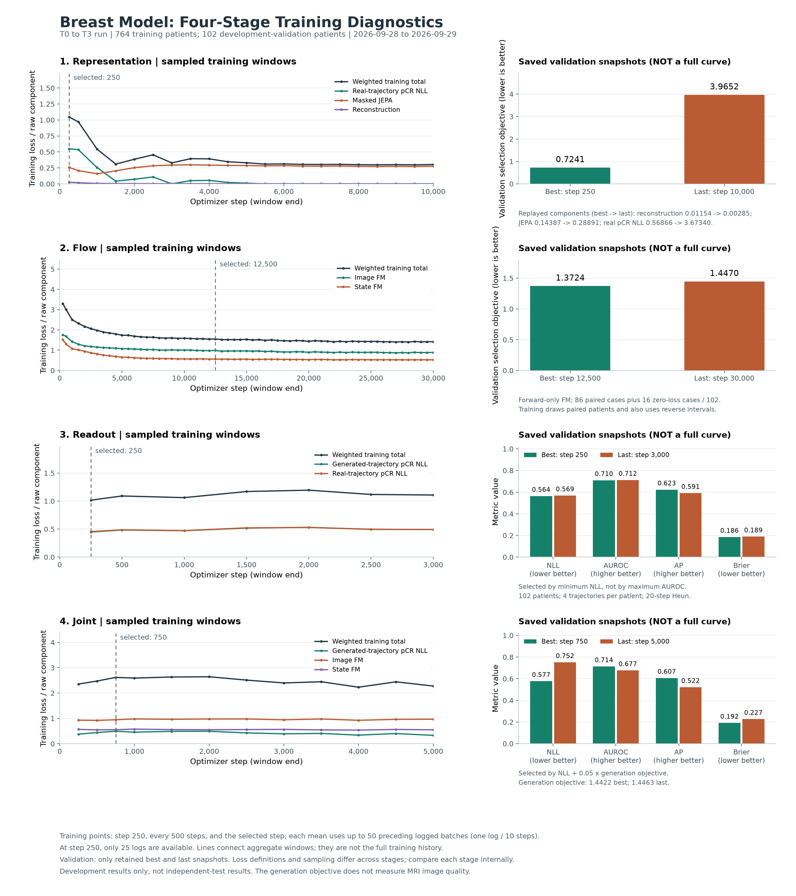

# 乳腺模型训练完成与诊断报告

核查日期：2026-09-29。四阶段训练于 2026-09-29 08:24:57（北京时间）完成，共 48,000 次优化器更新。核查读取了原始训练日志、检查点和验证记录，并用原验证函数重新计算指标；没有执行训练更新或改变原始权重。

本目录发布聚合统计、汇总训练点和绘图脚本，不包含患者标识、病例清单、逐例预测、原始训练日志、影像或权重。机器可读结果见 [summary.json](summary.json)，汇总训练点见 [training_curves.json](training_curves.json)。

## 主要结论

四阶段均正常完成计算，但表征阶段的分类监督严重过拟合，联合阶段后期也出现分类过拟合。flow 后期进入平台并有轻度验证退化，readout 相对稳定。目前没有原样增加训练步数的依据，也没有必须整套从头重训的证据。

当前实际任务是 **T0 预测 T3 的单区间模型，采用四阶段优化**，不是已经训练和验证过的 T0→T1→T2→T3 多段纵向预测模型。分类阶段的开发验证 AUROC 约为 0.71；已有分支对照没有提供“生成未来改善 pCR 预测”的正面证据。这些结果不属于独立测试。

## 模型与四阶段训练

推理链路为：T0 三相 MRI 的冻结 VQ latent 与四项基线临床变量 → 影像和疾病状态表征 → 生成 T3 latent 与状态 → 每条轨迹输出 pCR 概率 → 平均轨迹概率。

“三相”指同一次 DCE-MRI 的平扫、首次增强、晚期增强，不是三个纵向随访时点。临床变量为年龄、HR、HER2 和 MammaPrint。治疗方案特征为空，本轮没有验证不同治疗方案的反事实预测。

| 阶段 | 作用 | 更新的主要模块 | 实际步数 / 选中步数 |
| --- | --- | --- | ---: |
| representation | 真实 MRI 编码、重建、遮挡预测，以及真实轨迹和 T0 的 pCR 监督 | 编码器、重建与相差头、遮挡预测器、条件与历史模块、pCR 头；EMA 教师跟随更新 | 10,000 / 250 |
| flow | 在 T0 条件下学习未来影像 latent 与语义状态的联合生成 | 耦合影像与语义速度网络、条件与历史模块；编码器和 pCR 头冻结 | 30,000 / 12,500 |
| readout | 让 pCR 头适应生成未来，同时保留真实轨迹及 T0 分类监督 | 仅 pCR 头，生成器冻结 | 3,000 / 250 |
| joint | 微调生成与 pCR 预测，约束影像和语义状态一致性 | pCR、条件与历史、语义流、影像流中间层与解码侧；影像下采样侧和表征编码器冻结 | 5,000 / 750 |

VQ 编解码器全程冻结。后续阶段加载前一阶段的 `best.pt`，没有接续退化的 `last.pt`；表中选中步数来自检查点的 `step`。

原划分保留 764 名训练患者和 102 名开发验证患者，分别有 524、86 人具有真实 T3 监督。batch=4、累积=1，患者抽样允许重复。flow 仅抽取有 T3 的训练患者，其他阶段还能利用缺少 T3 但有 pCR 标签的患者。

## 指标计算

验证集有 pCR 阳性 32 人、阴性 70 人。原验证协议为每人 4 条生成轨迹、每条 20 步 Heun。先计算每条轨迹的 sigmoid 概率，再取均值：

```text
p_i = (sigmoid(logit_i1) + ... + sigmoid(logit_i4)) / 4
```

平均 logits 后再 sigmoid、平均影像后再分类，或默认 8 条轨迹的推理结果，均不能视为同一个协议。

| 指标 | 计算与解释 |
| --- | --- |
| AUROC | 阳性得分高于阴性得分的概率，并列算半分；共有 32×70 个阳阴配对。0.7136 不是 71.36% 分类正确率 |
| AP | `sklearn.metrics.average_precision_score`；源码字段 `auprc` 实际计算的是 AP |
| NLL | `-mean(y*log(p)+(1-y)*log(1-p))`，越低越好，会惩罚过度自信的错误预测 |
| Brier | `mean((p-y)^2)`，越低越好 |
| 准确率 | 固定 `p>=0.5` 为阳性，计算 `(TP+TN)/102`；没有用验证结果搜索阈值 |
| 敏感度 | `TP/32`，阳性检出率 |
| 特异度 | `TN/70`，阴性识别率 |

全部预测阴性也有 **70/102=68.63%** 准确率，但敏感度为零，因此应同时看 AUROC、AP 和敏感度。

representation 和 flow 的已有验证记录是复合损失或速度场训练目标，不是已经训练好的生成轨迹 pCR 准确率，也不是 MRI 的 MAE、SSIM。现有记录没有 T1、T2 或各随访时点的分类成绩。

## 分类结果

四份分类检查点重新执行原 `validate()` 后，AUROC、AP、Brier、NLL、selection_score 与原记录的差值均为 **0**。表征 best/last 的验证总分也完全复现。准确率、敏感度和特异度由本次逐患者概率复算，公开目录只保留聚合结果。

| 检查点 | 步数 | AUROC | AP | NLL | Brier | 准确率 | 敏感度 | 特异度 |
| --- | ---: | ---: | ---: | ---: | ---: | ---: | ---: | ---: |
| readout/best | 250 | 0.7096 | 0.6230 | 0.5640 | 0.1855 | 74.51% | 31.25% | 94.29% |
| readout/last | 3,000 | 0.7121 | 0.5907 | 0.5687 | 0.1891 | 73.53% | 34.38% | 91.43% |
| joint/best | 750 | 0.7136 | 0.6067 | 0.5774 | 0.1918 | 73.53% | 46.88% | 85.71% |
| joint/last | 5,000 | 0.6772 | 0.5219 | 0.7519 | 0.2272 | 69.61% | 40.63% | 82.86% |

| 检查点 | TP | FN | TN | FP |
| --- | ---: | ---: | ---: | ---: |
| readout/best | 10 | 22 | 66 | 4 |
| readout/last | 11 | 21 | 64 | 6 |
| joint/best | 15 | 17 | 60 | 10 |
| joint/last | 13 | 19 | 58 | 12 |

例如，readout/best 准确率为 `(10+66)/102=74.51%`，敏感度为 `10/32=31.25%`；joint/best 准确率为 `(15+60)/102=73.53%`。joint 在默认阈值下检出更多阳性，也增加了阴性误报，不能宣称某个模型在所有指标上更好。

readout 按最小 NLL 选模；joint 按最小 `NLL+0.05*generation_objective` 选模，均不是按最高 AUROC 选模。

2,000 次患者 bootstrap 得到 joint/best AUROC 的 95% 区间约 **[0.5985, 0.8234]**；joint/best 减 readout/best 的 AUROC 差值区间约 **[-0.0289, 0.0400]**，包含零。joint/last 相比 joint/best 的 NLL 增量区间为 **[0.0619, 0.2973]**，支持后期分类概率质量退化。这些区间以选中模型和本次生成采样为条件，不修正反复开发选模，也不替代独立测试。

## 临床基线和生成未来分支

本次检查了模型已有的临床逻辑回归先验，以及同一模型不使用生成未来的 T0-only 分支，没有训练新模型。临床先验采用 FP32，T0 MRI 分支采用原 BF16 设置。这是当前模型的分支诊断，不能代替独立训练的消融实验。

| 已有分支 | AUROC | AP | NLL | 准确率，阈值 0.5 |
| --- | ---: | ---: | ---: | ---: |
| 四项临床特征先验 | 0.6908 | 0.5047 | 0.5680 | 71.57% |
| readout/best，仅 T0 | 0.7107 | 0.6259 | 0.5611 | 75.49% |
| readout/best，T0 与生成 T3 | 0.7096 | 0.6230 | 0.5640 | 74.51% |
| joint/best，仅 T0 | 0.7150 | 0.6086 | 0.5687 | 71.57% |
| joint/best，T0 与生成 T3 | 0.7136 | 0.6067 | 0.5774 | 73.53% |

本次加入生成未来没有提高 AUROC、AP 或 NLL。差异较小，不足以断言生成机制普遍无效，但没有提供生成 T3 改善 pCR 预测的证据。单一阈值准确率的变化不能替代概率质量与排序比较。

## 训练诊断

[诊断图 PNG](training_diagnostics.png) / [PDF](training_diagnostics.pdf)。



左侧在第 250 步、每 500 步及选中步数显示之前最多 50 条日志的小批次损失均值，每条日志间隔 10 步；第 250 步只有 25 条记录。连接线用于展示这些汇总点，不表示公开了完整训练日志。右侧只有实际保留的 best/last 验证结果，**不是完整验证曲线**。不同阶段的目标、权重和采样不同，不能直接比较绝对 loss。

### 数值与完整性

四阶段分别有 1,000 / 3,000 / 300 / 500 条训练记录，共 4,800 条，每 10 步连续记录，已记录数值均有限。源码每一步检查非有限 loss，并在裁剪时检查非有限梯度。控制器和阶段日志均确认完成，没有因非有限数值或显存错误中止的证据。

| 阶段 | 日志采样点裁剪比例 | 最大裁剪前梯度范数 |
| --- | ---: | ---: |
| representation | 10.10% | 473.38 |
| flow | 36.87% | 69.61 |
| readout | 99.33% | 12.39 |
| joint | 99.60% | 47.72 |

裁剪阈值为 1，日志记录裁剪前范数；大于 1 不代表裁剪失败。比例只覆盖日志采样点。readout/joint 频繁裁剪值得后续检查学习率和损失梯度平衡，但不能仅凭此判断梯度爆炸。

### Representation：分类严重过拟合，重建仍改善

| 验证分量 | 第 250 步 best | 第 10,000 步 last |
| --- | ---: | ---: |
| 重建 | 0.011541 | 0.002850 |
| masked JEPA | 0.143868 | 0.288913 |
| 真实轨迹 pCR NLL | 0.568658 | 3.673395 |
| 三项之和，选模分数 | 0.724066 | 3.965158 |

训练末 50 条日志的真实轨迹 pCR NLL 均值约 **0.0000093**，验证为 **3.6734**，是分类严重过拟合的直接信号。重建验证误差仍降低，不能说所有表征功能都在退化；JEPA 教师随训练更新，数值变化还包含目标变化。

第 250 步是首次验证，无法确定 0 到 250 步是否存在更好的检查点。后续阶段使用这个早期 best，因此不能仅因 representation/last 很差就否定整个实验。

### Flow：后期平台或轻度过拟合

第 12,500 步验证分数 **1.37243**，第 30,000 步 **1.44695**，升高约 5.43%。选中步附近的 50 条训练日志平均 loss 为 **1.55470**，末 50 条为 **1.41833**；训练继续改善，验证没有改善，符合轻度过拟合或优化平台。

train/val loss 不能直接相减：训练包括反向任务且仅抽取有 T3 的 524 人；验证仅做前向任务，86 人有配对、16 人返回零，均值最后除以全部 102 人。有配对者的最佳验证均值约为 **1.62777**。这不影响同一固定验证集内的选模顺序，但影响分数解释。

生成 MRI 的价值仍需解码后图像指标、真实变化区域评价和复制 T0 的对照，不能从 flow loss 单独判断。

### Readout：相对稳定的平台

第 250 步最佳 NLL 为 **0.56402**，末次 **0.56873**，升高 0.83%；AUROC 略升，AP 和 Brier 略差。训练前后 50 条 marginal pCR NLL 均值约 **0.48325 / 0.49265**，没有持续下降趋势。现有证据更接近平台与小幅波动，不能据此认定欠拟合或支持延长训练。

### Joint：后期分类过拟合

第 750 步到第 5,000 步，验证 NLL **0.57743→0.75187**、AUROC **0.71362→0.67723**。选中步前 50 条训练日志的 marginal pCR NLL 均值 **0.49273**，末 50 条 **0.32872**。训练分类目标改善而验证变差，支持后期分类过拟合；混合目标下的优化漂移也不能完全排除。

验证生成约束仅从 **1.44217→1.44633**，加权影响约 **0.000208**；分类 NLL 增加 **0.17443**，解释了几乎全部选模评分退化。问题主要是分类泛化，而不是已记录生成约束突然发散。

## 选模与后续实验

1. 保留本轮，不整套从头重训、不原样增加步数。四阶段最优均早于预算终点，表征与 joint 有过拟合证据；学习率也已按原预算衰减。
2. pCR 概率预测保留 `readout/best.pt` 为优先比较基线，`joint/best.pt` 作为联合生成候选。联合阶段应选 best 而非 last，但 joint/best 不保证优于 readout/best。
3. 下一轮增加第 0 步验证、保存每次验证及分项，使用早停或较短预算并加密早期验证。当前没有早停，首次验证在第 250 步。
4. 优先检验表征阶段 pCR 权重与正则化，以及从 readout/best 开始的较短联合微调和较小更新范围，使用固定对照与多个种子。不能把本轮 750 步最佳当作通用预算。
5. 先验证生成的增量价值：采用统一生成噪声的评估、独立训练的消融，以及单独的 MRI 生成质量评价。约 0.004 的 AUROC 差异不能证明联合训练有效。
6. 多时间段预测需要新的纵向实验，明确 T0、T1、T2 各起点可用信息和未来任务；给当前 T0→T3 任务增加步数不会自动得到 T0→T1→T2→T3 模型。

## 限制与复现

102 人反复参与模型开发，冻结 VQ 也曾用相同患者选模；上游定位器的患者重叠仍未核验。本次没有独立测试成绩，单个随机种子的结果和 bootstrap 均不能消除开发选模偏差。

readout 和 joint 的原验证函数使用相同 seed，但 joint 每位患者预测后额外计算 flow loss 并消耗随机数，所以跨阶段生成噪声不完全一致。复算确认的是原协议和原指标；严格比较阶段收益仍需统一噪声的评估。

在已安装 NumPy 和 Matplotlib 的 Python 环境中，从本目录运行即可重建图像。项目的可选依赖 `.[report]` 包含绘图依赖：

```bash
python plot_training.py
```

脚本只读取本目录的 `summary.json` 和 `training_curves.json`，不需要原始病例或权重。它复现公开聚合图，不能代替对受控原始数据的完整指标复算。

受控数据的复算脚本：[训练核查](../../../breast_world_joint/scripts/audit_training.py)、[表征分量](../../../breast_world_joint/scripts/representation_components.py)、[已有分支对照](../../../breast_world_joint/scripts/baseline_diagnostics.py)。公开聚合文件由[白名单导出工具](../../../tools/export_breast_review.py)生成；运行这些复算工具需要自行准备原始训练输出和有权使用的数据。

代码依据：[训练与验证](../../../breast_world_joint/src/responsewm/training.py)、[阶段更新范围](../../../breast_world_joint/src/responsewm/model.py)、[损失](../../../breast_world_joint/src/responsewm/losses.py)、[指标](../../../breast_world_joint/src/responsewm/metrics.py)、[T0→T3 清单准备](../../../breast_world_joint/scripts/prepare_existing_ispy2.py)。
